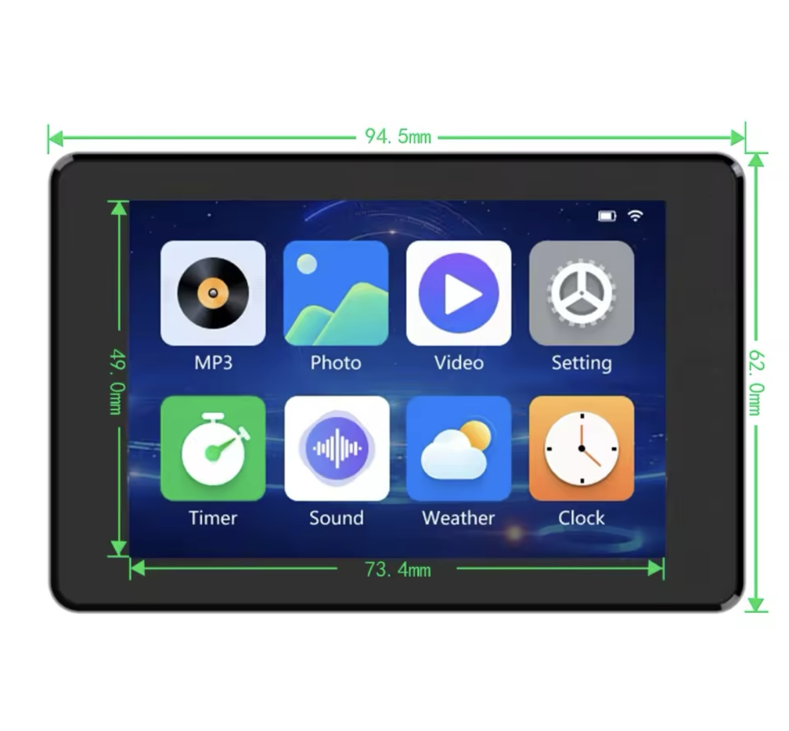

# JC3248W535EN - Proyecto con PlatformIO



Este repositorio contiene una versión limpia y funcional del firmware para la placa JC3248W535EN, utilizando PlatformIO, ESP-IDF 5.3 y LVGL 8.3. Aquí encontrarás todo lo necesario para compilar y cargar el firmware fácilmente.

## Descripción

Este proyecto está pensado para quienes tienen la placa JC3248W535EN y desean compilar el firmware de manera sencilla en VSCode/PlatformIO. El código aprovecha las capacidades de ESP-IDF 5.3 y la librería gráfica LVGL 8.3, permitiendo una experiencia visual avanzada en la pantalla del dispositivo.

> **Nota:** No es compatible con Arduino ESP32, ya que requiere ESP-IDF 5.3.0 o superior. Arduino ESP32 utiliza ESP-IDF 4.x y no compilará correctamente.

## Requisitos

- VSCode + [PlatformIO](https://platformio.org/)
- Placa JC3248W535EN
- Cable USB para programación

## Instrucciones rápidas

1. **Clona este repositorio:**

   ```sh
   git clone https://github.com/tomasschus/JC3248W535EN.git
   cd JC3248W535EN
   ```

2. **Abre la carpeta en VSCode**
3. **Conecta la placa por USB**
4. **Compila y sube el firmware** usando el botón de PlatformIO o:

   ```sh
   pio run --target upload
   ```

## Créditos y referencias

- Basado en archivos originales del fabricante: <https://s.click.aliexpress.com/e/_DFO5uIV>
- Imágenes y documentación en la carpeta `docs/`

---

# JC3248W535EN - PlatformIO Build (English)

This repository provides a clean, working PlatformIO build for the JC3248W535EN board, using ESP-IDF 5.3 and LVGL 8.3. It is intended to help users easily build and flash the firmware.

## Requirements

- VSCode + [PlatformIO](https://platformio.org/)
- JC3248W535EN board
- USB cable

## Quick Start

1. **Clone this repo:**

   ```sh
   git clone https://github.com/tomasschus/JC3248W535EN.git
   cd JC3248W535EN
   ```

2. **Open the folder in VSCode**
3. **Connect the board via USB**
4. **Build and upload** using PlatformIO or:

   ```sh
   pio run --target upload
   ```

> For more details, see the documentation in the `docs/` folder.
